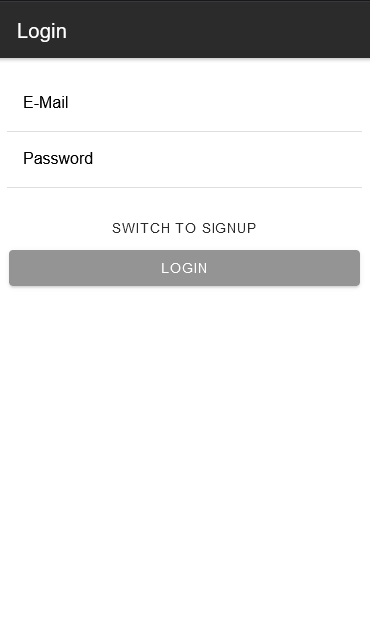
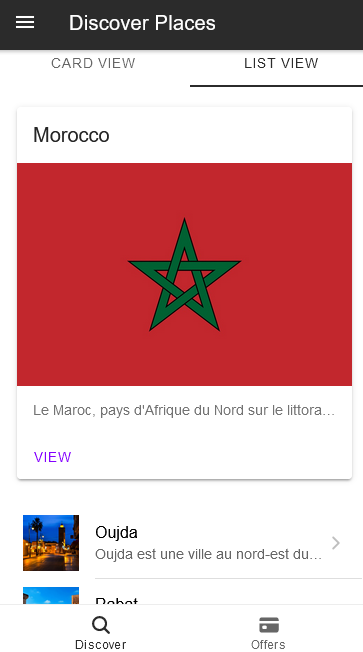
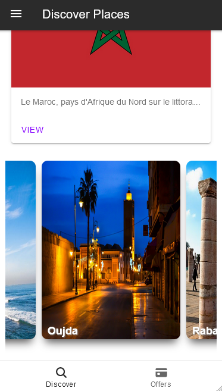
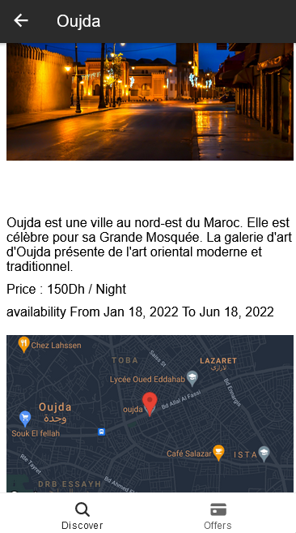
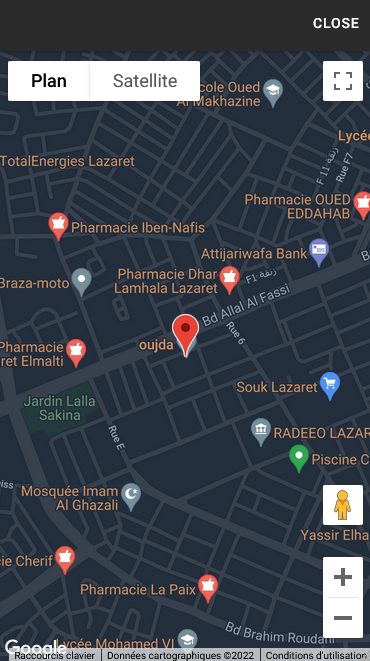
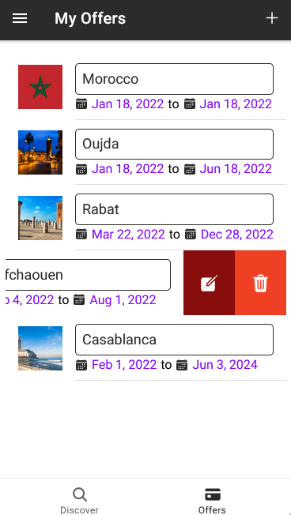

#  Ionic Angular Project

App for travel booking

## :floppy_disk: Setup

* Add Project Id, Google maps and Firebase API keys to environment.ts
* Add Private Key(.json) from Firebase Admin SDK to index.js (search for `privatekey.json` and replace it with your path)
* Run the following command from the root of your local project directory: `firebase deploy`
* To start the server on _localhost://8100_ type: `ionic serve`
* To generate normal www build file: `ionic build`
* Build for Android app: `ionic capacitor run android`

* create an admin account to control the app with email: `admin@admin.com`

## :camera: Screenshots

 \
 \
 \
 \
 \
 \
 \